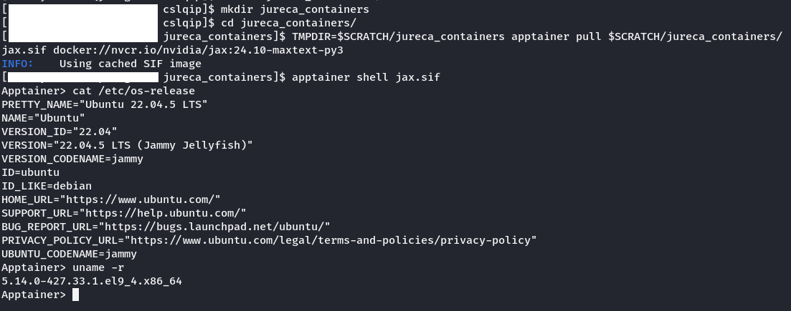
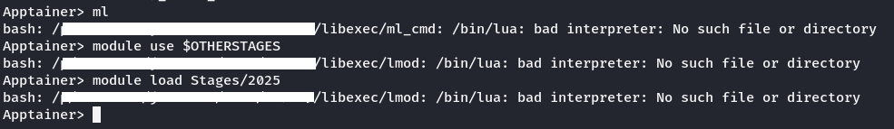
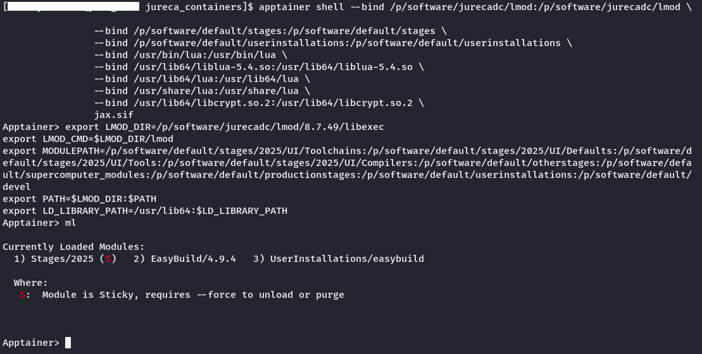
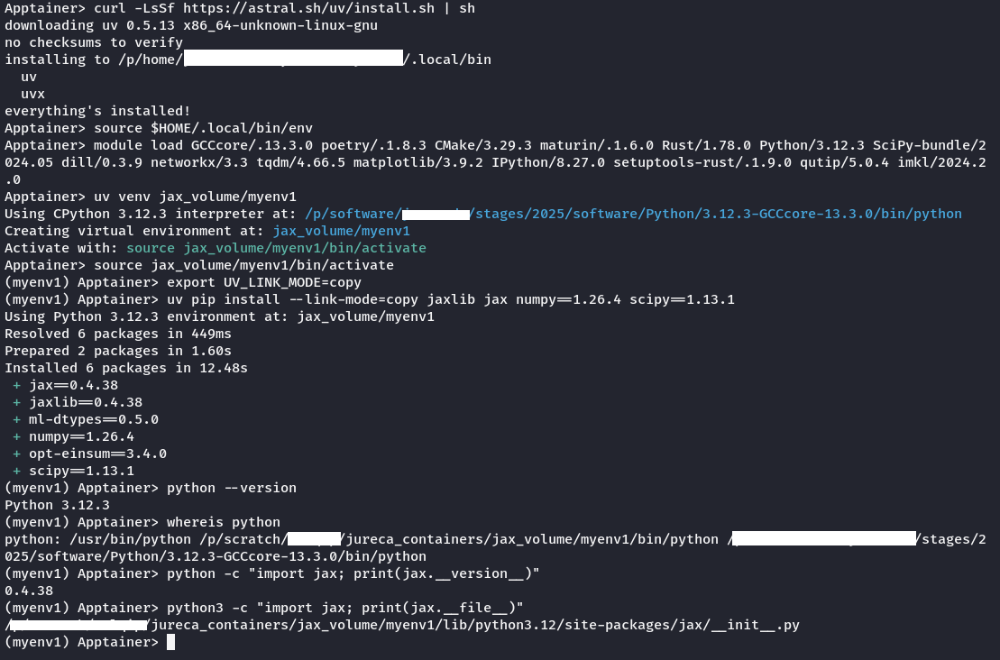

In this example we are going to develop a jax container and set the configuration options compatible with our HPC system JURECA.

# What is Containerization?

Containerization is a form of virtualization that packages an application with all its dependencies into a single unit (the container).
Unlike Virtual Machines (VMs), containers share the host system's kernel (in this case, JURECA) and hence being these much faster to start, smaller in size and more efficient in resource usage.

Containers encapsulate everything an application needs to run (libraries, tools...).

Containerization is used for software development, deployment, microservices architecture, high-performance computing, data sciente, machine learning...
### Benefits:
  1. Portability: You can run containers consistently accross different platforms (local, cloud or on-premises)
  2. Efficiency: Containers use fewer resources than VMs because they share the host system's OS kernel.
  3. Scalability: Containers can easily be scaled horizontally using orchestration tools like Kubernetes.

### Cons:
  1. Limited isolation: As they share the host OS kernel, security risk are higher compared to VMs.
  2. Complex Networking: Configuring and managing container networks can be challenging
  3. Storage management: Persistent storage for containers require additional setup.

## Most used container technologies

Docker, Kubernetes, Podman and Singularity (now Apptainer) are the most used container technologies. Docker is the most popular containerization platform. Singularity is specifically designed for scientific and HPC environments. It emphasizes reproducibility and security.

## Singularity (Now Apptainer)

Singularity/Apptainer is designed to address unique challenges faced in HPC such as security, performance and integration with shared resources. It easily integrates with container technologies like Docker, enabling users to convert Docker images to a Singularity-compatible format. Supports integrations with schedulers like Slurm.

### JAX container

To get the jax container we need to access the site [Link](https://catalog.ngc.nvidia.com/orgs/nvidia/containers/jax/tags) and get the latest tag image path: `nvcr.io/nvidia/jax:24.10-maxtext-py3`

  1. First, let's move to the folder $SCRATCH
  2. Create a folder where we will save our container `jureca_containers`
  3. Move `jureca_containers` and run the following command:
`TMPDIR=$SCRATCH/jureca_containers apptainer pull $SCRATCH/jureca_containers/jax.sif docker://nvcr.io/nvidia/jax:24.10-maxtext-py3`

Once downloaded, activate a shell by doing:
`apptainer shell jax.sif`. You will get a terminal like the following. You will see that you have the container active.



Nonetheless, this container doesn't have access to EasyBuild features because is an isolated environment. How do we link the libraries, folders and declare the necessary variables to make EasyBuild work in our container as well?



#### Declaration

After a deep study on how to link all the necessary files, folders and declaring the necessary variables (through an iterative process interpreting the error prompts) we come up with the final command to activate the shell container linked with the easybuild required files:

```
export ACTUAL_PATH=${PWD}
mkdir $ACTUAL_PATH/jax_volume
apptainer shell --bind /p/software/jurecadc/lmod:/p/software/jurecadc/lmod \
                --bind /p/software/default/stages:/p/software/default/stages \
                --bind /p/software/default/userinstallations:/p/software/default/userinstallations \
                --bind /usr/bin/lua:/usr/bin/lua \
                --bind /usr/lib64/liblua-5.4.so:/usr/lib64/liblua-5.4.so \
                --bind /usr/lib64/lua:/usr/lib64/lua \
                --bind /usr/share/lua:/usr/share/lua \
                --bind /usr/lib64/libcrypt.so.2:/usr/lib64/libcrypt.so.2 \
                --bind ${ACTUAL_PATH}/jax_volume:/opt/volume \
                jax.sif
```

Note: Jax container and JURECA use the same /usr/lib64/ folder, so linking the complete folder generates an error overwriting content in the jax folder. To avoid such error, the contents necessary from JURECA in the usr/lib64 folder are linked into the jax container, for example, in this case is `/usr/lib64/liblua-5.4.so`.

Once the shell is activated, declare the following variables:

```
export LMOD_DIR=/p/software/jurecadc/lmod/8.7.49/libexec
export LMOD_CMD=$LMOD_DIR/lmod
export MODULEPATH=/p/software/default/stages/2025/UI/Toolchains:/p/software/default/stages/2025/UI/Defaults:/p/software/default/stages/2025/UI/Tools:/p/software/default/stages/2025/UI/Compilers:/p/software/default/otherstages:/p/software/default/supercomputer_modules:/p/software/default/productionstages:/p/software/default/userinstallations:/p/software/default/devel
export PATH=$LMOD_DIR:$PATH
export LD_LIBRARY_PATH=/usr/lib64:$LD_LIBRARY_PATH
```

##### Why the following declarations?

These bind commands are used to map files or directories from the host system into the container's environment. Software like lmod, or capabilities like stages or userinstallations need to be available into the container as well as lua. In order for the container to work properly not only the bindings are necessry but the declaration of variables. LMOD_CMD, LMOD_DIR, MODULEPATH... are variables that are loaded in JURECA and must be declared within the container too. After executing these commands, you observe that you can load any module you want:



##### Install jax with Python 3.12 inside container:

After being able to use EasyBuild in the container, we will:

1. Download and install uv, a tool to create isolated virtual environments: `curl -LsSf https://astral.sh/uv/install.sh | sh`
4. Activate uv: `source $HOME/.local/bin/env`
5. Load required modules: `module load GCCcore/.13.3.0 poetry/.1.8.3 CMake/3.29.3 maturin/.1.6.0 Rust/1.78.0 Python/3.12.3 SciPy-bundle/2024.05 dill/0.3.9 networkx/3.3 tqdm/4.66.5 matplotlib/3.9.2 IPython/8.27.0 setuptools-rust/.1.9.0 qutip/5.0.4 imkl/2024.2.0`
6. Create and activate new virtual environment: `uv venv jax_volume/myenv1`, `source jax_volume/myenv1/bin/activate`
7. Configure hardlinking behaviour: `export UV_LINK_MODE=copy`
8. Install jax and dependencies: `uv pip install --link-mode=copy jaxlib jax numpy==1.26.4 scipy==1.13.1`
9. Check Python setup: `python --version`, `whereis python`
10. Check where jax is installed: `python -c "import jax; print(jax.__version__)"`, `python3 -c "import jax; print(jax.__file__)"`



Observe that the jax container was built for Python 3.10. Using this process we obtained a container for Python 3.12 (the one from JURECA Stages/2025).
To run it in an automated way, download the .sh file, activate it with `chmod +x apptainer.sh` and execute it with `./apptainer.sh`.
