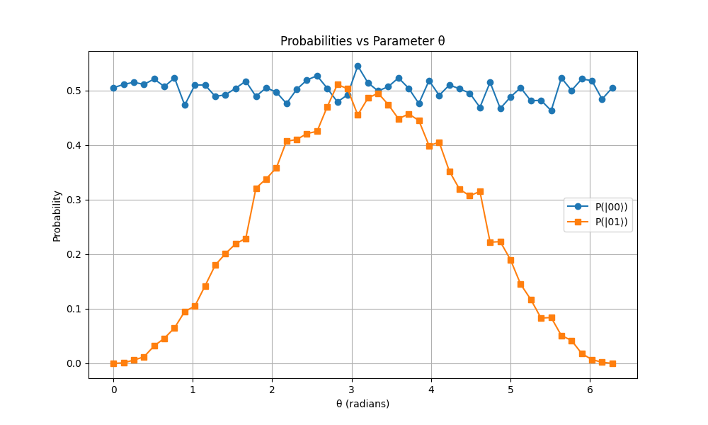

## Qiskit-aer (CPU + GPU capabilities)

Containerization example Docker for Qiskit-aer-gpu.
When developing the Qiskit/1.2.4 module for JUNIQ Stages/2025 we found out that extension library [qiskit-aer-gpu](https://pypi.org/project/qiskit-aer-gpu/#files) was not released for aarch64 architecture (JEDI). To avoid requesting a whl release, we use a Docker container built from scratch to create a whl file that contains qiskit-aer CPU and GPU capabilities.
We will test it locally and insert it into our easyconfig and test it from our HPC system JEDI (aarch64) and JURECA (x86_64)

#### Docker container

1. Check if Docker is running: `sudo systemctl status docker`
2. If it is not running, start it: `sudo systemctl start docker`
3. To allow your current user have permissions to interact with the Docker daemon run: `sudo usermod -aG docker $USER`

5. Restart your sheel or reboot your laptop: `reboot`
6. Test docker access: `docker run hello-world`

After installing and setting up Docker, it is necessary to abilitate the capability of simulate other architectures. Our current Docker engine uses `amd64` architecture (our laptop) and the intended whl file is for `aarch64` (JEDI). Docker cannot run `aarch64` binaries on `amd64` systems unless emulation is explicitly enabled. For that run the following:

1. Update kali and install qwmu-user-static: `sudo apt update && sudo apt install -y qemu-user-static`

2. Enable multi-architecture support in Docker: `docker run --rm --privileged multiarch/qemu-user-static --reset -p yes`

   
4. Specify the platform for building. It will take a while: `docker build --platform linux/arm64 -t aerbuilder .`

5. Run the Docker container: `docker run --platform linux/arm64 --rm -it aerbuilder /bin/bash`
6. You will get the following terminal:

##### Production of whl file

After setting up the multi-architecture aarch64 container with Docker on my amd64 laptop, the steps can be followed by the container. Follow the commands:

1. Activate the environment: `source qk_aer/bin/activate`
2. Move to: `cd qiskit-aer`

3. Run the build command tailoring it to `aarch64` GPU CUDA from JEDI. JURECA uses NVIDIA GH200 GPU and JEDI USES NVIDIA GH200, both use CUDA architecture `7.5`. It can be observed [here](https://developer.nvidia.com/cuda-gpus): `python ./setup.py bdist_wheel -- -DAER_THRUST_BACKEND=CUDA -DAER_CUDA_ARCH="7.5" -DAER_PYTHON_CUDA_ROOT=/qk_aer`.

  
4. This command will create the .whl file in the `dist/` directory.

5. Repair the whl file to make it manylinux-compatible. To ensure it works on the HPC system, run auditwheel with the specified exclusions: `auditwheel repair --exclude libcudart.so.12 --exclude libcustatevec.so.1 --exclude libcutensornet.so.2 --exclude libcutensor.so.1 --exclude libcutensorMg.so.1 --exclude libcusolver.so.11 --exclude libcusolverMg.so.11 --exclude libcusolver.so.12 --exclude libcusolverMg.so.12 --exclude libcusparse.so.12 --exclude libcublas.so.12 --exclude libcublasLt.so.12 --exclude libnvJitLink.so.12 -w dist/ dist/qiskit_aer-0.15.1-cp312-cp312-linux_aarch64.whl`

#### Install whl file locally in a virtual environment

1. Open a new terminal. Identify the container ID: `docker ps`
2. Copy the wheel into your host system (laptop): `docker cp <CONTAINER_ID>:/qiskit-aer/dist/qiskit_aer-0.15.1-cp312-cp312-manylinux_2_17_aarch64.manylinux2014_aarch64.whl ~/qiskit_aer-0.15.1-cp312-cp312-manylinux_2_17_aarch64.manylinux2014_aarch64.whl`

3. Send the file to your remote host via: `scp /path/to/qiskit_aer-0.15.1-cp312-cp312-manylinux_2_17_aarch64.manylinux2014_aarch64.whl <username>@<remote_host>:/path/to/locate/qiskit_aer`

#### Install whl file in JEDI and JURECA

Connect to JEDI, move to the folder where your qiskit_aer is located and run the following commands:

1. Load basic modules: `module load Stages/2025 UserInstallations GCC/13.3.0 Python/3.12.3`
2. Create Python environment: `python -m venv venv_jedi`
3. Load environment: `source venv_jedi/bin/activate`
4. Load modules required to install Qiskit (dependencies and builddependencies): `module load binutils/.2.42 CMake/3.29.3 Ninja/1.12.1 pkgconf/.2.2.0 pybind11/.2.12.0 Rust/1.78.0 maturin/.1.6.0 hatchling/.1.24.2 nlohmann_json/3.11.3 Python/3.12.3 SciPy-bundle/2024.05 sympy/1.13.2 dill/0.3.9 SymEngine-python/0.13.0 matplotlib/3.9.2 IPython/8.27.0 Seaborn/0.13.2 setuptools-rust/.1.9.0 h5py/3.12.1-serial PySCF/2.7.0 scikit-learn/1.5.2 CUDA/12 cuQuantum/24.11.0-CUDA-12 cuQuantum-Python/24.11.0-CUDA-12 scikit-build/0.17.6`
5. Install qiskit, your whl file and the external dependencies required to be compatible with out HPC: `pip install setuptools==70.0.0 PyJWT==2.9.0 nvidia-nvjitlink-cu12==12.4.127 nvidia-cuda-runtime-cu12==12.4.127 nvidia-cublas-cu12==12.4.5.8 nvidia-cusparse-cu12==12.3.1.170 nvidia-cusolver-cu12==11.6.1.9 wheel==0.43.0 qiskit-ibm-provider qiskit-ibm-runtime  qiskit-algorithms qiskit-nature qiskit-machine-learning qiskit_aer-0.15.1-cp312-cp312-manylinux_2_17_aarch64.manylinux2014_aarch64.whl qiskit==1.2.4`

#### Test module

1. Run the following script: `python3 test_qiskit_aer_gpu_aarch64.py`

If you get an outcome as follows, the qiskit_aer_gpu module works correctly locally on your HPC system. You should get a plot as follows:

###### JEDI

Now we repeat the process but developing an easyconfig ([here](https://github.com/3v401/HPC_tools/blob/main/modules/IBM/Qiskit-1.2.4-GCC-13.3.0.eb)) for JEDI, compiling the module and loading it. After loading, run the following script: `python3 test_qiskit_aer_gpu_aarch64.py`

###### JURECA

Now we repeat the process but developing an easyconfig ([here](https://github.com/3v401/HPC_tools/blob/main/modules/IBM/Qiskit-1.2.4-GCC-13.3.0.eb)) for JURECA, compiling the module and loading it. After loading, run the following script: `python3 test_qiskit_aer_gpu_aarch64.py`

Congratulations!🥳 Your docker container generated a whl file required for our Qiskit/1.2.4 module in `aarch64` architecture which is not available yet in PYPI!
