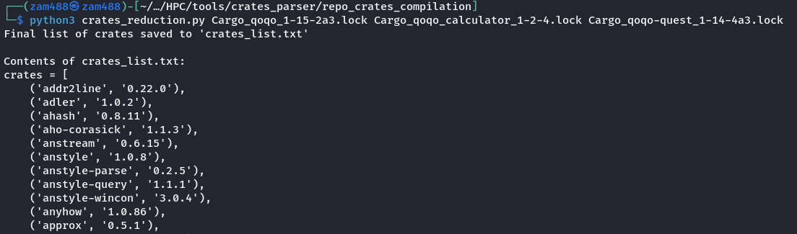
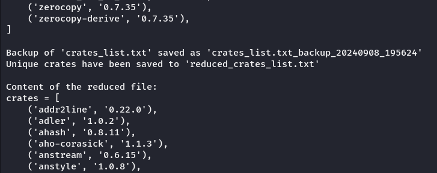
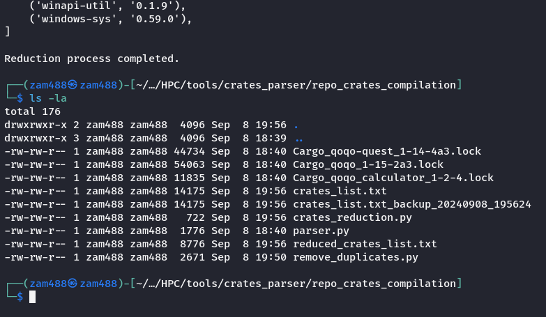

When developing a Rust-based EasyConfig for HPC systems with EasyBuild, managing the 'crates' parameter can be particularly time-consuming. Repositories often contain multiple crates (such as 'maturin' or 'qoqo-quest'), each with different versions and dependencies and many times repeated.
In large repositories, like the 'qoqo-quest' repository, managing these crates becomes complex. The 'qoqo-quest' repository, for instance, contains 468 crates extensions, but only 293 of these are unique, leading to a need of automated process for efficient management and removal of duplicates.
Doing this by hand can take a cost of one day or two, and with this automated program it takes less than 4 seconds. The **reduction of time cost is of 99.998%**.

### Steps

1. The 'crates_reductor.py' tool processes all '.lock' files from the 'qoqo-quest' repository, extracting their crates extensions and saving them into a 'crates_list.txt' file.

 2. In second step reads the 'crates_list.txt' file and processes the names and versions line by line. This step:
    
    i. If both name and version are the same, deletes common entries and only keeps one.

    ii. If name is the same and versions are different, saves them.

    iii. If both name and version are different, saves them.

The goal of this step is to eliminate duplicate dependencies while preserving necessary variations.

3. The tool outputs a reduced crates list, cutting down Rust extension calls from 468 to 293, **significantly optimizing** the module development process.

