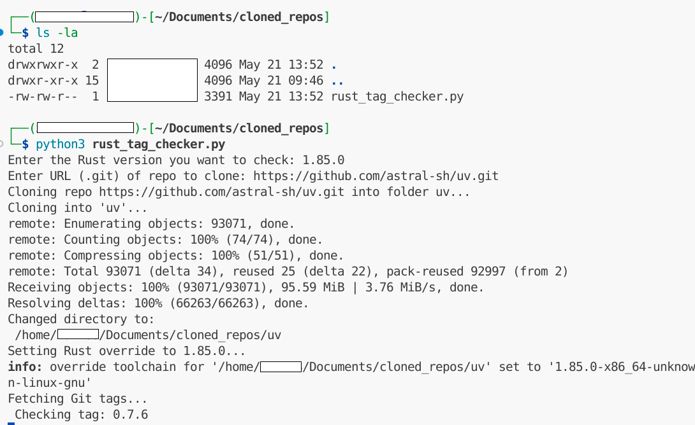

# Rust Version Compatibility Checker for Git Projects

**What is the newest tag in this Rust project that still builds with Rust X.Y.Z?**

This Python script determines which Git tags of a Rust project are compatible with a specific Rust version inserted (e.g., 1.85.0). When developing modules from source, for example `uv`. There are some uv versions that are compatible with Rust 1.85.0 and other that aren't. They key is to determine which of them. This process is very tedious which is done manually but with this Python script you can do it automatically checking **all its versions releases**.

What this script does:

1. Clones Git repository
2. Sets specific Rust version
3. Loops over all Git tags
4. Runs cargo check to see if that tag builds with the selected Rust version
5. List all compatible versions and not compatible versions.

## Requirements:
1. Rust environment: `rustup install <VERSION_you_want_to_test>`
2. Python3: `python3 rust_tag_checker.py`

