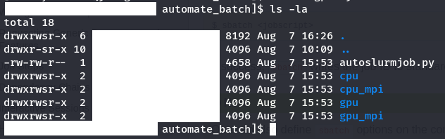
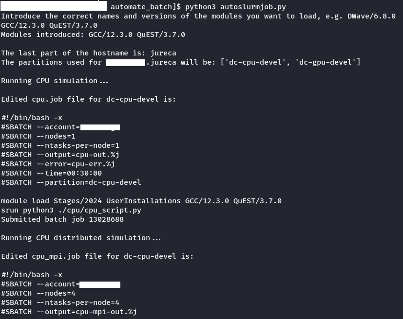
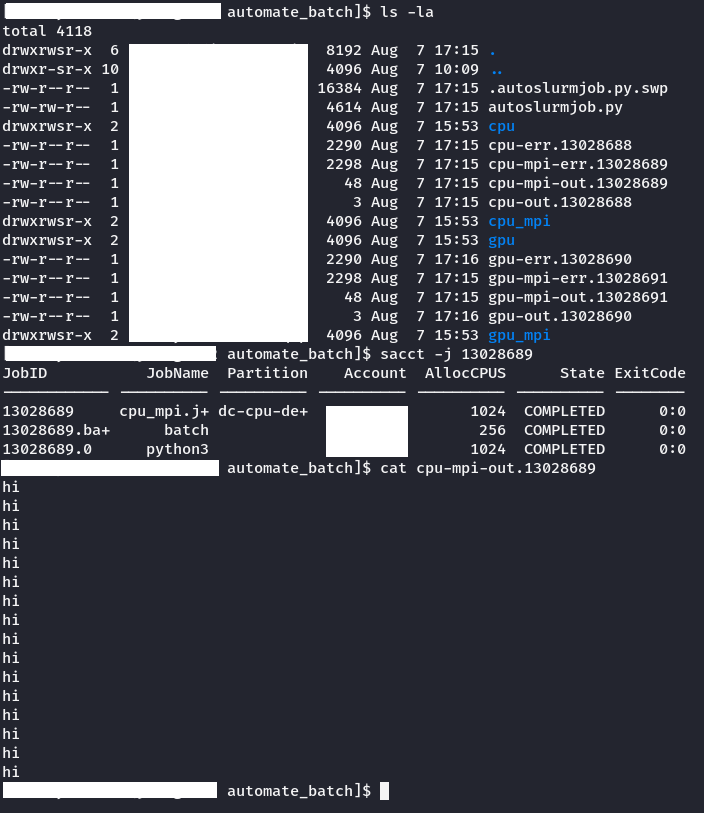

Developing and testing modules across different HPC systems can be a tedious and error-prone task. To streamline this process, I created `autoslurmjob`, a Python-based tool that automates several steps:

  1. Identifies the HPC System: Determines whether you're using JURECA, JUWELS, or JUSUF.
  2. Module Loading: Prompts you to specify the modules you want to load.
  3. Job Editing: Automatically modifies job scripts to run tests for CPU, GPU, CPU_MPI, and GPU_MPI configurations.
  4. Outcome Reporting: Returns the results in a structured format.

This task, which typically takes up to 30 minutes/one hour due to manual scripting and potential errors, is now automated. `autoslurmjob` executes all commands in less than 5 seconds, displays the edited files, saves backups, and provides organized results.

In this example, we demonstrate running tests on the JURECA machine using the QuEST module developed in this repository.
1. **Get access to the folder**: Connect to the HPC System and Run autoslurmjob.

2. **Input Required Modules**: The program will prompt us to introduce some modules. Here, we introduce the toolchain and the QuEST module:

3. **System detection and Job Submission**: The program automatically detects the HPC system being used (JURECA), lists the partitions, edits the job scripts, and submits the jobs to the JURECA system. After waiting a few seconds, we can check that all files are correctly saved:

4. **Check the Outcome**: As expected, the prompt shows 16 salutations because we set --ntasks=4 and --nodes-per-task=4.

