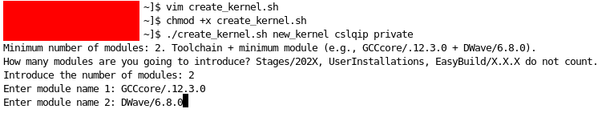
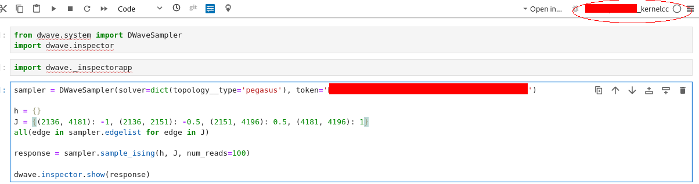
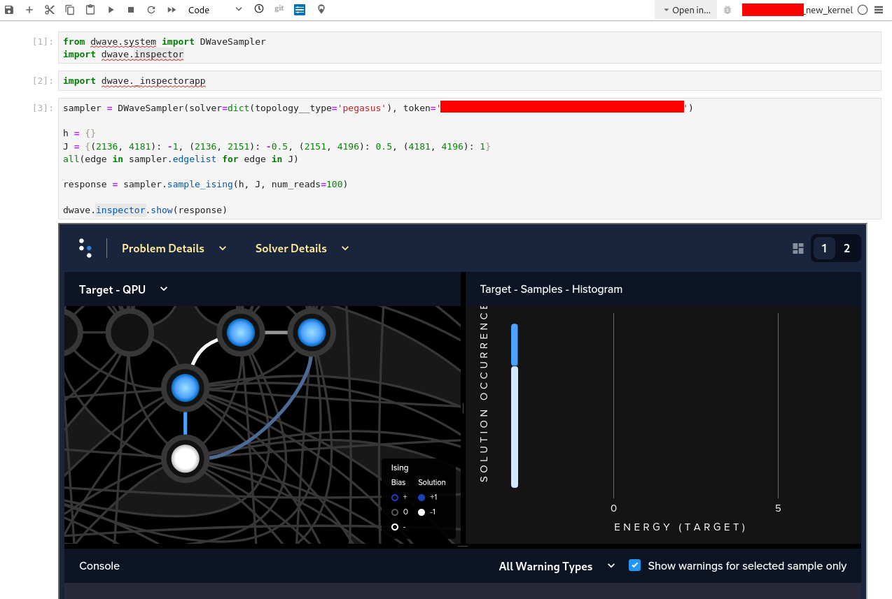

# Kernel

The kernel is the core component of an operating system (OS). It acts as a bridge between the hardware of a computer and the software applications that run on it. The kernel is responsible for managing system resources such as CPU, memory and I/O devices. Building a custom Jupyter kernel allows for tailored computational environments that can meet specific needs. In the context of Jupyter Notebooks, a kernel is the computational engine that executes the code contained in the notebook cells. Different kernels can support different programming languages (e.g., Python, R, Julia). In our case we will use Python.

A kernel bridged to a Jupyter Notebook connected to an HPC system allows the notebook to use the computational resources of the HPC environment with a Jupyter Notebook interface instead of using a Linux/UNIX terminal.

### Steps:

1. Create Python Environment: To ensure a clean environment free from conflicts with other Python environments on the system.
2. Create a launch script (`kernel.sh`) for the Jupyter kernel: Used to start the kernel with the necessary environment variables and configurations. It includes paths to the virtual environment, environment settings and other initialization commands. By creating this `.sh` we will ensure that the kernel starts with the correct settings and environment every time.
3. Create Jupyter kernel configuration (`kernel.json`) script: This file will allow Jupyter to recognize and launch the custom kernel

In this repository we will develop a basic Jupyter Notebook kernel for an HPC (High-Performance Computing) system.

### Example

#### Load a kernel for DWave

In this example, we'll develop a kernel for DWave/6.8.0. DWave/6.8.0 is a module I created using EasyBuild for my HPC system. The module is compiled and tested, ready to use. We'll activate the kernel to call this DWave module and run a simulation in a Jupyter notebook connected to our HPC.

1. Usage of the script: ./create_kernel.sh KERNEL_SUFFIX_NAME PROJECT_NAME KERNEL_TYPE_CATEGORY

`KERNEL_SUFFIX_NAME`: Suffix at the end of the kernel name

`PROJECT_NAME`: Project you are assigned to

`KERNEL_TYPE_CATEGORY`: private, project, or other

2. Set toolchain and modules: In this case GCCcore/.12.3.0 and DWave/6.8.0
3. Kernel creation:

Now, you can use this custom kernel in your Jupyter notebook to run simulations for the DWave/6.8.0 module (this kernel was created for this specified module, if you want to try other module you must run the script again of other set of modules!).

#### Open Jupyter Notebook

Open your Jupyter notebook connected to your HPC (Cloud environment). On the top right corner, when selecting the kernel, choose the newly created kernel (for me it is XXXX_kernel_test).

#### Run test code

Use the following code to test the setup (you need your own token ID if you plan to use DWave for testing. Create an account at DWave Leap [here](https://cloud.dwavesys.com/leap/login/?next=/leap/)):

Bingo! 🥳 You should see the outcome we were looking for: A GUI for the position of the qubits in the DWave quantum annealer using our kernel.

##### Pathway of communication:

You (developer) → kernel → Jupyter notebook → HPC system (cloud) → DWave annealer (cloud)

*Computation*

DWave annealer (cloud) → HPC system (cloud) → Jupyter notebook → kernel → You (developer)
